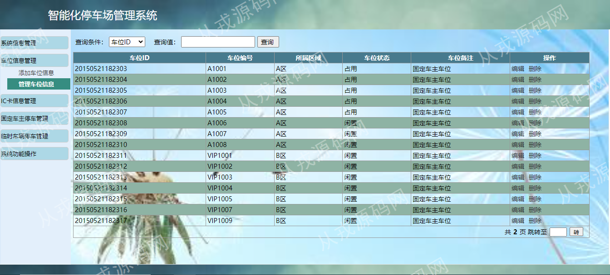

<h1 align="center">55.智能化停车场管理系统</h1>

 获取sql文件 QQ: 386869957 QQ群: 377586148 

 [推荐站点: 从戎源码网](https://armycodes.com/) 

## 简介

> 本代码来源于网络,仅供学习参考使用!
> 
> 登录地址：http://localhost:8080/
> 
> 用户名密码：SAdmin 123123
>

## 项目介绍
基于servlet+jsp的智能化停车场管理系统：前端jsp、jquery，后端 servlet、jdbc，集成车位信息管理、IC卡管理、固定车主停车、临时车辆停车等功能于一体的系统。

## 功能介绍

- 车位信息管理：车位信息的增删改查、关键词搜索
- IC卡信息管理：IC卡信息的增删改查、关键词搜索、添加IC时需要和车位信息绑定关联
- 固定车主停车管理：停车信息管理、停车信息列表、停车信息关键词搜索、停车信息删除、出入场设置、添加入场信息、设置出场
- 临时车辆停车管理：车主入场、临时停车只需要填入临时IC卡号和车牌信息即可、车主出场信息列表、车主出场信息删除
- 系统功能：修改密码、退出登录
- 用户信息管理：用户信息的增删改查、关键词搜索
- 角色信息管理：角色信息的增删改查、关键词搜索

## 环境

- <b>IntelliJ IDEA 2021.3</b>

- <b>Mysql 5.7.26</b>

- <b>Tomcat 7.0.73</b>

- <b>JDK 1.8</b>

## 运行截图

